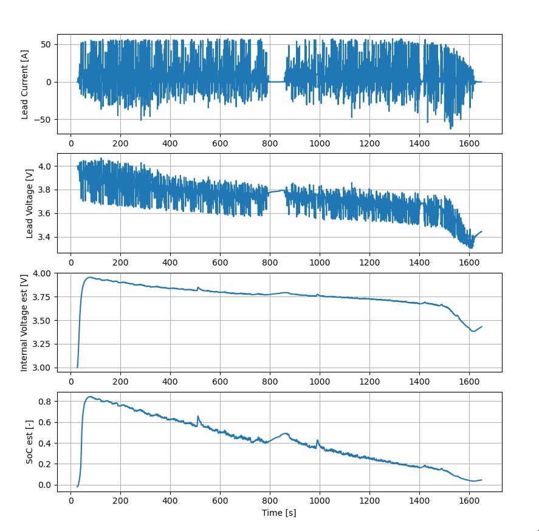

# pyCellSim

- Run `main.py` to estimate FSN22 Endurance lowest cell data
- Run `mainSim.py` to simulate and estimate a current step on a single cell
- Run `plotV-Q.py` to plot the (made up, but kinda accurate I guess) voltage-charge diagram used to estimate SoC from internal cell voltages

# Example: FSN22 Endurance Lowest Cell

